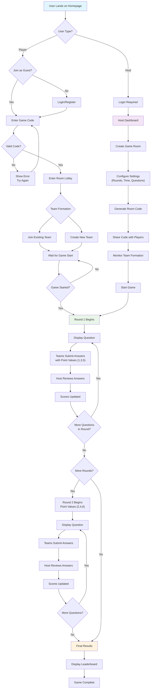
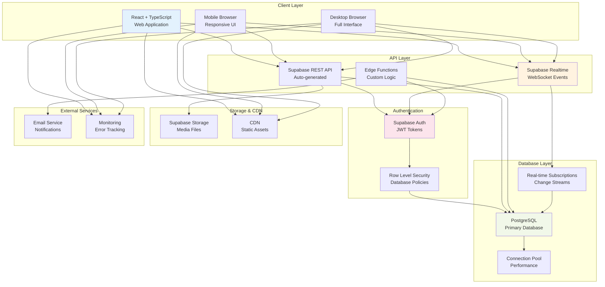
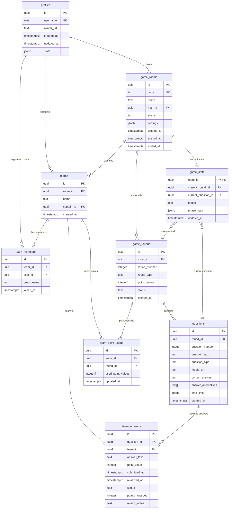
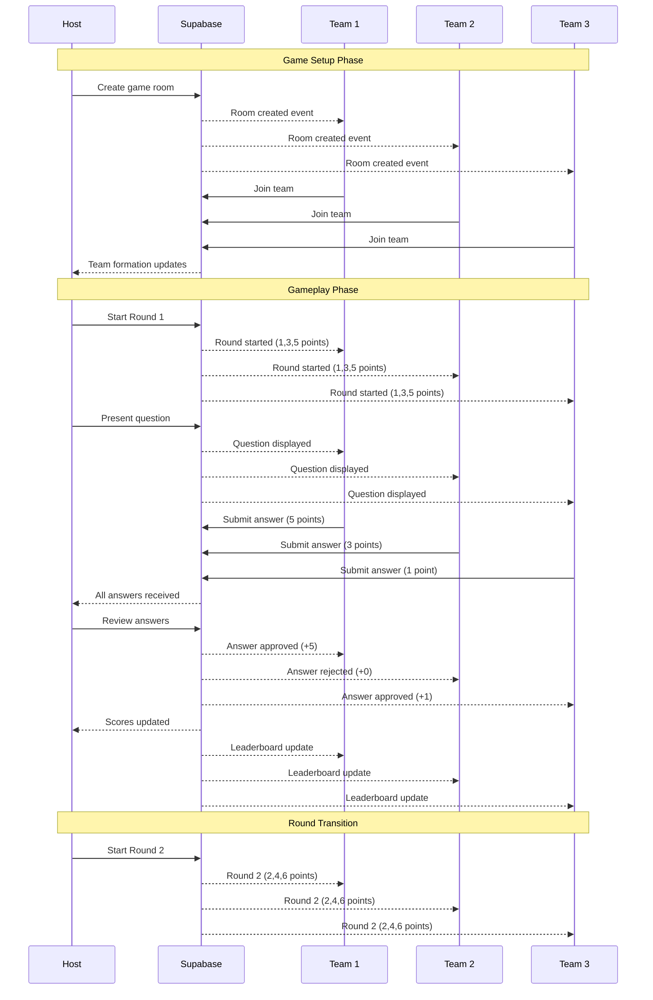
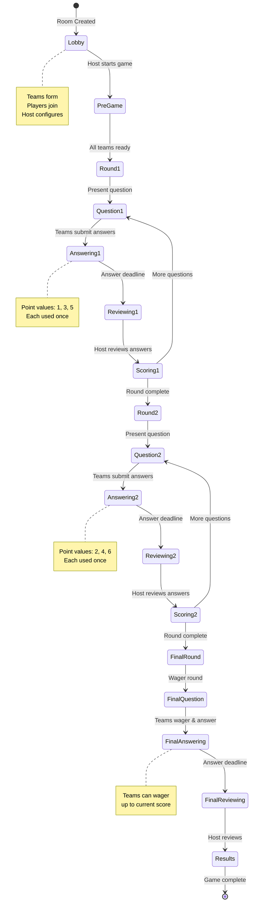

# Tony Trivia - System Diagrams
*Visual documentation of user flows and technical architecture*

## Overview
This document contains the system diagrams for the Tony Trivia platform in Mermaid format. These diagrams can be rendered in various tools and platforms that support Mermaid syntax.

## How to Use These Diagrams

### Rendering Options
- **GitHub/GitLab:** Paste the code blocks directly into markdown files
- **Mermaid Live Editor:** Visit [mermaid.live](https://mermaid.live) and paste the code
- **VS Code:** Install the Mermaid Preview extension
- **Notion:** Use Mermaid code blocks
- **Documentation sites:** Most support Mermaid rendering (GitBook, Docusaurus, etc.)

---

## 1. User Journey Flow Diagram

This diagram shows the complete user flow from landing on the homepage through game completion, covering both host and player paths.

### Key Flow Points
- **Entry Points:** Homepage with role selection (Host vs Player)
- **Authentication:** Required for hosts, optional for players
- **Room Management:** Code-based joining system
- **Team Formation:** Flexible team creation and joining
- **Game Phases:** Clear progression through rounds with different point values
- **Host Controls:** Complete oversight of game flow and scoring

---

## 2. Technical Architecture Diagram

This diagram illustrates the technical stack and how different components interact within the Tony Trivia system.

### Architecture Highlights
- **Client Layer:** Multi-device support with responsive design
- **API Layer:** Supabase-powered with custom Edge Functions for complex logic
- **Authentication:** JWT-based with granular Row Level Security
- **Database:** PostgreSQL with real-time capabilities and connection pooling
- **Storage:** Integrated media handling and CDN distribution
- **Monitoring:** Comprehensive error tracking and performance monitoring

---

## 3. Database Entity Relationship Diagram

This diagram shows the relationships between all database tables in the system.

### Key Relationships
- **Profiles to Game Rooms:** One-to-many (hosts create multiple rooms)
- **Game Rooms to Teams:** One-to-many (multiple teams per room)
- **Teams to Members:** One-to-many (multiple players per team)
- **Rounds to Questions:** One-to-many (multiple questions per round)
- **Questions to Answers:** One-to-many (one answer per team per question)

---

## 4. Real-time Communication Flow

This diagram shows how real-time events flow through the system during gameplay.

---

## 5. Game State Machine

This diagram shows the different states and transitions during a trivia game.

---

## Using These Diagrams in Development

### 1. **Requirements Planning**
- Use the User Journey Flow to validate all user paths are covered
- Reference the Architecture Diagram when making technical decisions
- Use the Database ERD to understand data relationships

### 2. **Development Phases**
- **Phase 1:** Focus on basic flow (Lobby → Question → Answer → Score)
- **Phase 2:** Add real-time communication patterns
- **Phase 3:** Implement complete state machine

### 3. **Testing Strategy**
- Use flow diagrams to create end-to-end test scenarios
- Test each state transition in the state machine
- Validate real-time communication patterns

### 4. **Documentation Updates**
Remember to update these diagrams as the system evolves. They serve as living documentation that should reflect the current system architecture and user flows.

---

## Exporting and Sharing

To use these diagrams elsewhere:

1. **Copy the mermaid code blocks** from this document
2. **Paste into supported platforms** (GitHub, GitLab, Notion, etc.)
3. **Use Mermaid Live Editor** for customization and export to PNG/SVG
4. **Include in project documentation** for team reference

These diagrams provide a visual foundation for understanding and building the Tony Trivia platform. 